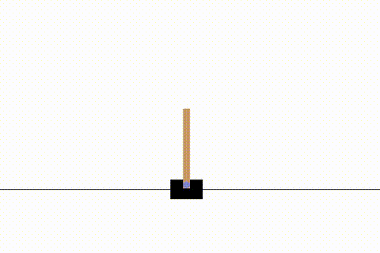
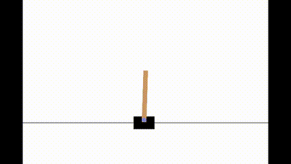
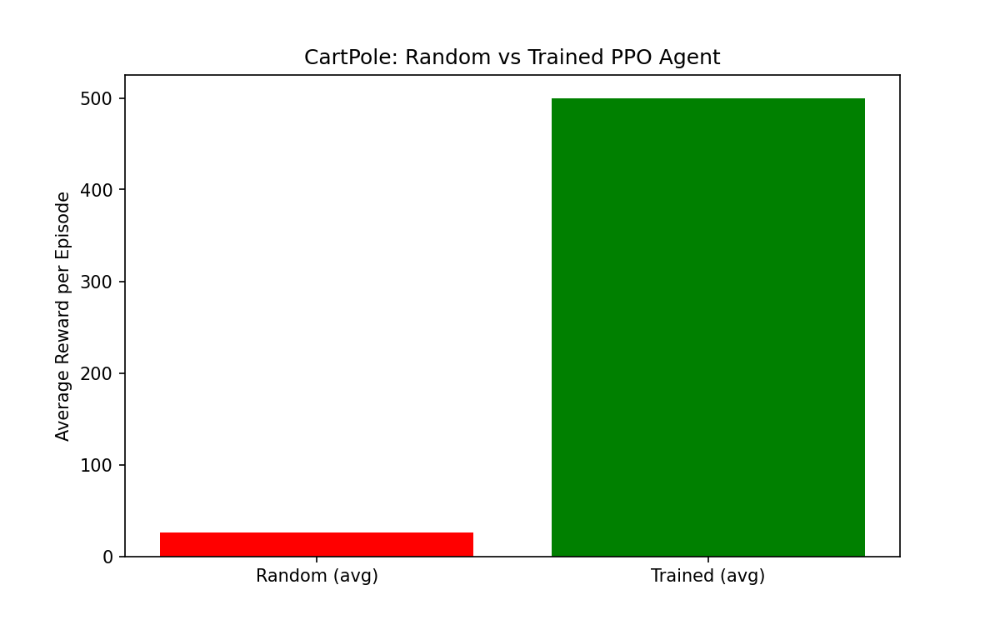

# 🤖 Robot RL Demo – CartPole with PPO  

This project shows how to train a reinforcement learning (RL) agent to **balance a pole on a cart** — no hardware, just simulation.  

It’s a beginner-friendly but powerful demonstration of how robots learn:  
- **Random policy** → fails fast  
- **Trained PPO policy** → balances stably  

---

## 🎥 Demo  

| Random Policy | Trained PPO |  
|---------------|-------------|  
|  |  |  

👉 See full side-by-side video in the repo (`cartpole_comparison.mp4`).  

---

## ⚙️ How it Works  

- 🕹️ **Environment**: [Gymnasium – CartPole-v1](https://gymnasium.farama.org/)  
- 🧠 **Algorithm**: PPO from [Stable-Baselines3](https://stable-baselines3.readthedocs.io/)  
- 🎯 **Reward signal**: *stay upright, don’t fall*  
- 📼 **Output**: Frames rendered → MP4 (via `imageio` / `moviepy`)  

---

## 📊 Results  

The trained PPO agent consistently outperforms a random policy:  

  

---

## 📂 Repository Structure  

